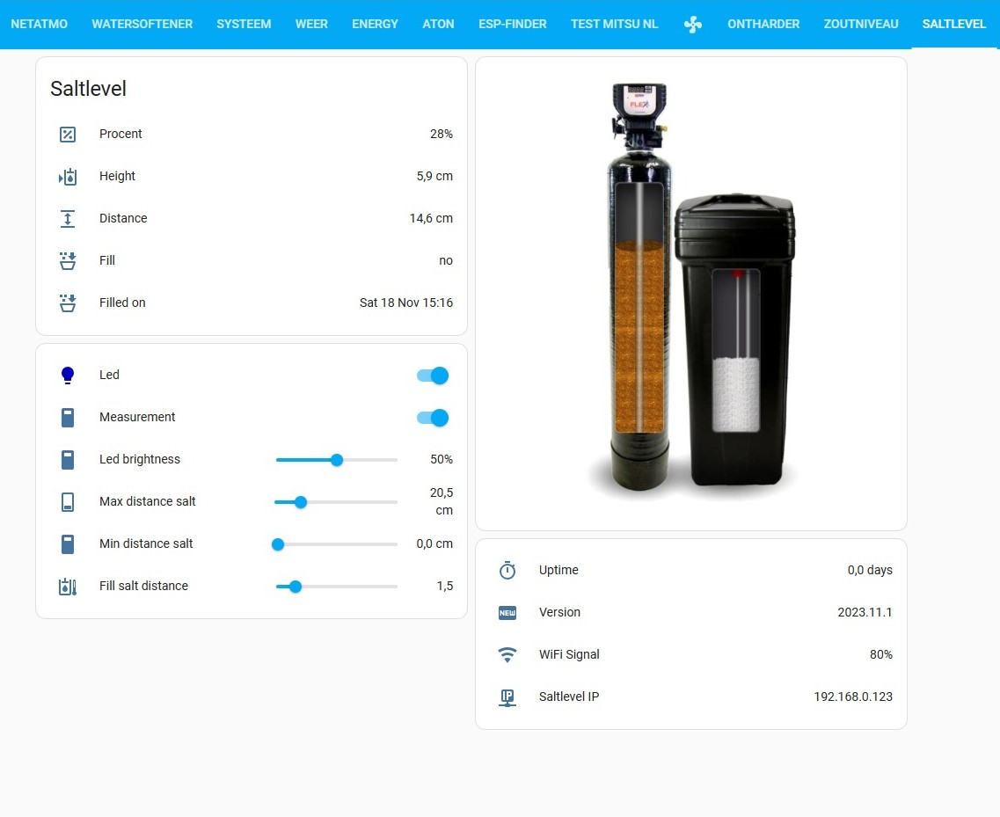

# Saltlevel measurement with AtomS3 lite and TOF sensor

## Hardware
The hardware consist of:
- the [Atom S3 lite](https://www.tinytronics.nl/shop/nl/development-boards/microcontroller-boards/met-wi-fi/m5stack-atom-s3-lite-esp32-s3-development-board) from M5stack
- the [TOF sensor](https://www.tinytronics.nl/shop/nl/platformen-en-systemen/m5stack/unit/m5stack-tof-unit) from M5stack
- option: [5cm cable](https://www.tinytronics.nl/shop/nl/kabels-en-connectoren/kabels-en-adapters/grove-compatible/m5stack-grove-kabel-5cm-10-stuks) (a litlle shorter then the original cable delivered with TOF sensor, only per 10 pieces)
- [3D printed](../README/Saltlevel_Atoms3_TOF.stl)  enclosure.

## Software
Everything is coded in ESPHOME
Connecting through wifi hotspot and [IMPROV bluetooth](https://www.improv-wifi.com/) is possible.

## Lovelace menu
For the salt level simulation, as seen in the underneath picture, create a directory /www/images and copy all the images
[/www/images](../www/images) to your home assistant directory

Voorbeeld dashboard: 


The dashboard itself can be placed in home assistant by: three dashes - edit dashboard - raw configuration editor
Copy and add the text from [lovelace_menu_nl.yaml](../home_assistant/lovelace_menu_nl.yaml) and click save.
You got now an extra menu Saltlevel

## Automations
[automation_saltalarm_en.yaml](../home_assistant/automation_saltalarm_nl.yaml) combine with automations.yaml (take notice of the indents) or better:

### File on own lokation: 
[automation_saltalarm_en.yaml](../home_assistant/automation_saltalarm_nl) put on own location:
Adjust configuration.yaml to:

```yml
homeassistant:
  packages: !include_dir_named packages
```

Then make directory /packages in /config and copy the automation_saltalarm_nl.yaml to this directory
Restart home assistant.

## Uitleg werking

Met de schuifregelaars de juiste hoogtes instellen.
Voorbeeld van de minimale en maximale hoogte vind u [hier.](../README/min_max_NL.jpg) 
Zout bijvullen afstand is de afstand vanaf wanneer er een alarm (automation) zal verstuurd worden (waarde van Bijvullen wordt dan "ja")

### LED
De LED op de AtomS3 lite is in of uit te schakelen. Helderheid op 0 is ook LED uit.
De LED verspringt van kleur bij:

0-25% zoutniveau in de tank = ROOD

25-75% zoutniveau in de tank = BLAUW

75-100% zoutniveau in de tank = GROEN

### DRUKKNOP
De drukknop heeft twee functies:
kort ingedrukt (led gaat uit): stop de niveaumeting, handig om bij te vullen van zout.
kort ingedrukt (led gaat aam): zet de niveaumeting voort.

Lang ingedrukt (voor 3 sec.). Registreer tijd en datum. Handig om te zien wanneer voor het laatst bijgevuld is.
Succes!

## Noot:
Er is een  [3d print](../README/Saltlevel_Atoms3_TOF.stl)  bestand bijgevoegd om zelf de behuizing te printen.
De behuizing dient met dubbelzijdige tape op het zoutreservoir aan de bovenkant gemonteerd te worden.
