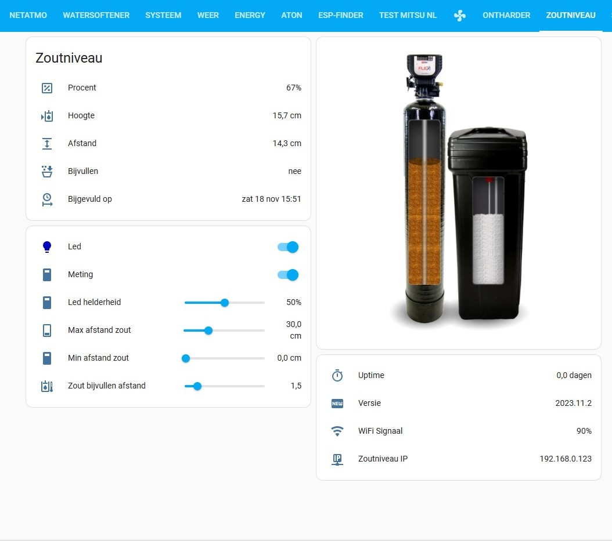

# Zoutniveau meting met AtomS3 lite en TOF sensor

## Lovelace menu
Om het lovelace menu volledig te benutten met de zoutniveau simulatie zoals hieronder in het dashboard te zien is, 
dient er een map /www/images aangemaakt te worden in je home assistant directory.
Kopieer daar alle plaatjes in van [/www/images](../www/images)

Voorbeeld dashboard: 


Het dashboard zelf kan geplaatst worden via home assistant drie puntjes - dashboard bewerken - ruwe configuratie editor
Tekst uit [/lovelace_menu_nl.yaml](../home_assistant/lovelace_menu_nl.yaml) daar aan toevoegen en opslaan.
U heeft nu een extra menu Zoutniveau

## Automations
[automation_saltalarm_nl.yaml](../home_assistant/automation_saltalarm_nl.yaml) samenvoegen met automations.yaml (let op inspringingen) of beter:

### Bestand op eigen lokatie: 
[automation_saltalarm_nl](../home_assistant/automation_saltalarm_nl) op een eigen lokatie zetten:
configuration.yaml aanpassen naar:

```yml
homeassistant:
  packages: !include_dir_named packages
```

Dan directory /packages aanmaken in /config en daar de automation_saltalarm_nl.yaml in kopieren
HA opnieuw starten

## Uitleg werking

Met de schuifregelaars de juiste hoogtes instellen.
Voorbeeld van de minimale en maximale hoogte vind u [hier.](../README/min_max_NL.jpg) 
Zout bijvullen afstand is de afstand vanaf wanneer er een alarm (automation) zal verstuurd worden (waarde van Bijvullen wordt dan "ja")

### Relais configuratie
In clack.yaml moeten de tijden nog aangepast worden aan je eigen tijden (timer) voor de simulatie van het regenereren in HA.
Even met een stopwatch ofzo, nadat de regeneratie handmatig gestart is. Elke keer dat de inwendige schuif beweegt is een stap (zie ook op het display vd clack)
Het kan zijn, dat je clack 5 cyclussen heeft ipv 4. Backwash, brine, backwash, rinse, fill. In de code is de 2e backwash eruit gehaald, wat het meest gangbaar is, voor de meeste ontharders. Anders kan je een timer toevoegen en de code wat aanpassen in clack.yaml

Bijgevoegd ook de plaatjes voor de simulatie van het zoutniveau:
naar /www/images kopieren

### Relais configuratie
De werking van de 2 relays moeten nog in de clack ingesteld worden:
* Relay 1 is voor de waterpulsen te tellen tijdens normale werking
* Relay 2 is voor eenmalig een puls te geven wanneer de ontharder regenereerd
Achter op de print staat welk draadje voor wat is om aan de relays aan te sluiten (de 3 aderige stekkerblok) 


Instellen: [Settings PDF](instelkaart%20clack%20ws1.pdf) Volledige handleiding in Engels: [Manual](Full-CLACKWS1-Manual.pdf)
1. next + pijltje omlaag -> 5 sec vasthouden
2. next (softening) is dan zichtbaar
3. doordrukken op next tot <rlY 1>  Deze op ON zetten (softening  L)
4. next
5. Dan op 2 L zetten  (elke flowmeter puls is dan 2 ltr)
6. next
7. set time: 0.01 min
8. next
9. set rlY 2 "time" to on  (geeft dan een puls bij regeneratie start)
10. next
11. set time: 0.01 min
12. 2x next en klaar

Succes!

## Noot:
Het monteren van de esp print in de behuizing is wel wat lastig.
De ESP print steekt achter de rand naar binnen, van de clack behuizing zodat deze weer gesloten kan worden met de kap.
Soms wil het esp printje uit de pinnen komen. (iets of wat speling mag wel)

Update: met een wemos s3 mini is dit probleem verholpen. Deze is wat kleiner.


